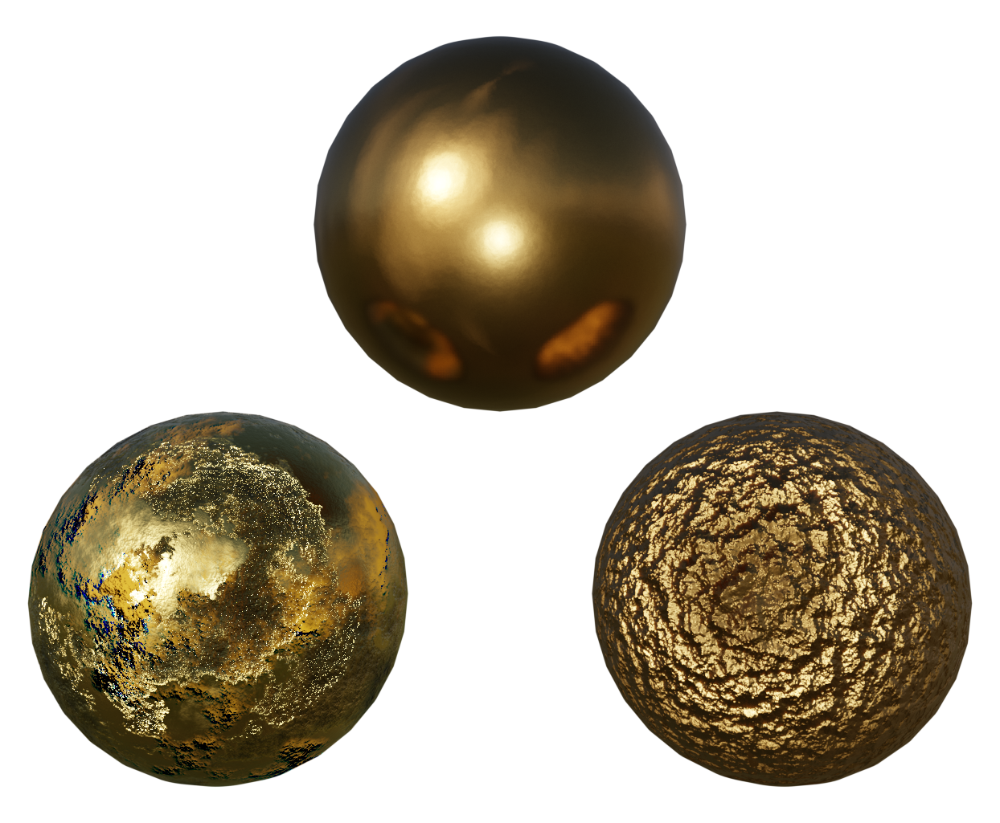
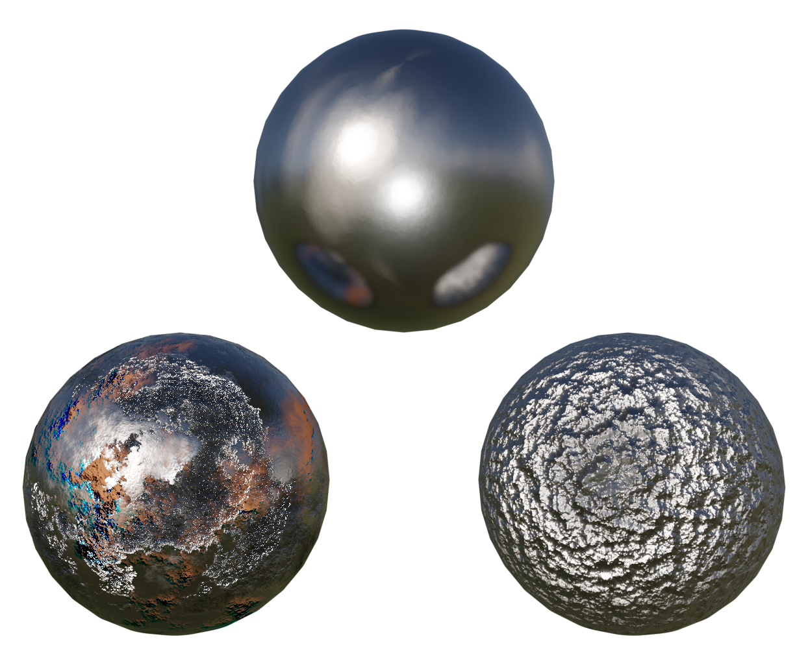
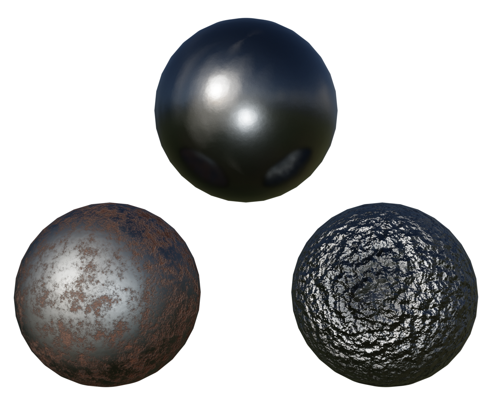
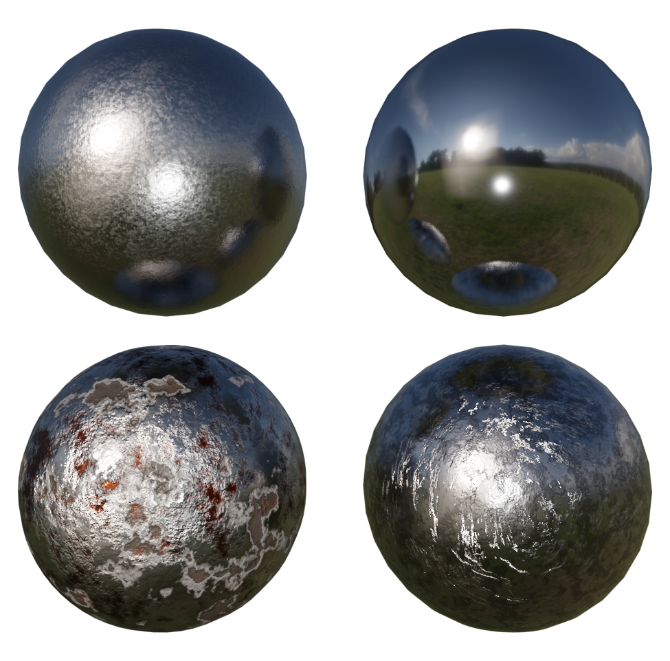
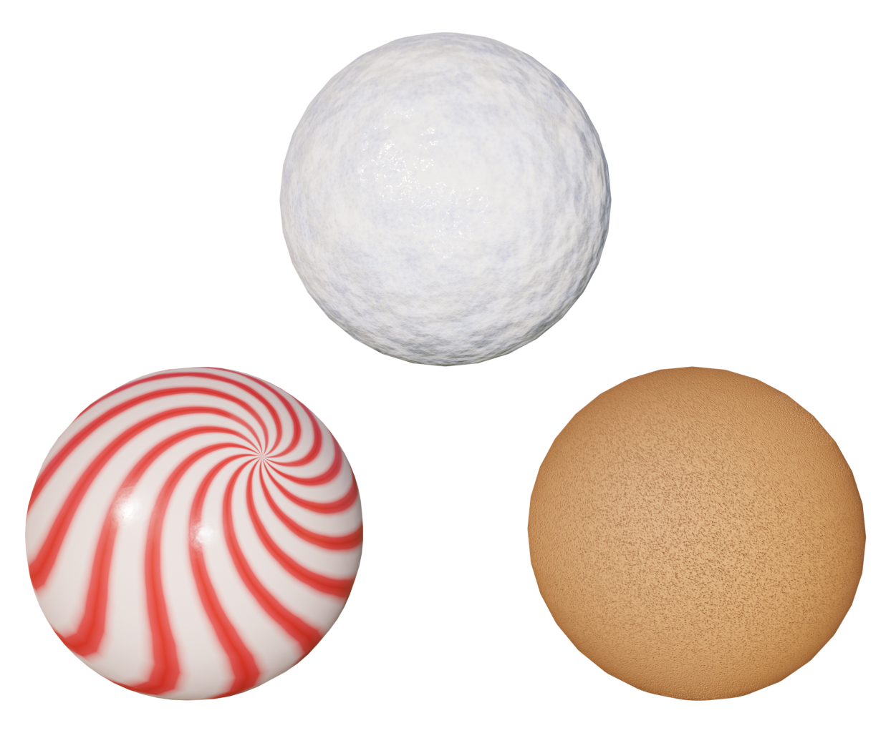

# Materials Addon

Authors -
[Anuraag Saxena](https://github.com/anuraag-saxena "Github"), [Ryan King Art](https://www.youtube.com/channel/UCIXjev1_mJ1plJhF9lGarQg "Youtube Channel")

* Installing the addon
    1. Download the zip folder
    2. Extract and keep only the ".py" extension file
    3. Open Blender,  
    Edit > Preferences > Add-Ons
    4. Choose Install button and select the MaterialsAddOn.py file.
    5. The addon is installed.

 

* Different Materials  
    Preview of Addon and Materials
        

            
        

    There are total 16 materials -
    * Precious Metals
        

        
        
        

    * General Metal
        

        
        
        

    * Winter
        

         
        

 

* These materials are made using the tutorial videos of [Ryan King Art](https://www.youtube.com/channel/UCIXjev1_mJ1plJhF9lGarQg "Youtube Channel"), so subscribe and support the Artist.

